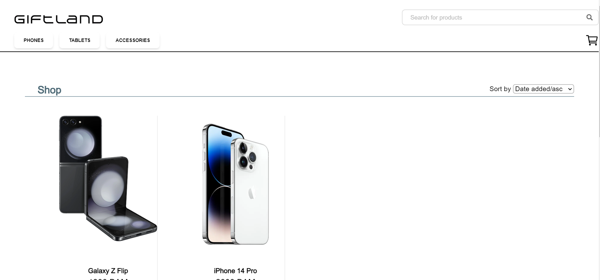

# GiftLand Ecommerce Website

This is a Ecommerce website created using [Next.js](https://nextjs.org/) and [Sanity.io](sanity.io). It started as a learning project by diving head first and learning by doing. The webpage design was crafted using Canva to bring a personalized touch to the project. 




## Getting Started

First, run the development server:

```bash
npm run dev
# or
yarn dev
# or
pnpm dev
# or
bun dev
```
Open [http://localhost:3000](http://localhost:3000) with your browser to see the result.
**Note** You have to setup your own Sanity account and upload your own products. Schemas are already provided.
[Guide](https://www.sanity.io/learn/course/day-one-with-sanity-studio/getting-started). You also have to provide your own Sanity keys to ".env" file.

## Technologies used
- Nextjs
- Tailwind
- Sanity.io 

## Progress
Project progress has halted but I plan on finishing it. Currently project is missing Cart functionalities and payment processing. I am also planning on revising schemas and also revision of search and filter functionality.

## My experience

During the work on this project I have learned a lot and I had quite fun doing it from design to development phase. Despite encountering challenges along the way, such as discovering more efficient methods and techniques, I found learning by doing to be rewarding. I'm eager to apply newfound knowledge to enhance the project further.
